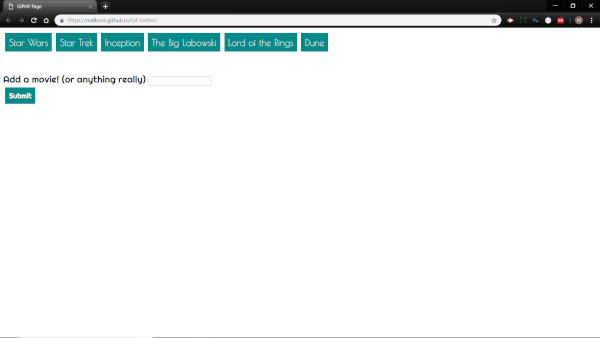

# Gif-Getter

#### Overview

This app uses Jquery to make AJAX calls to the Giphy API.  Jquery is also used to dynamically create buttons based on user inputs and to pause and unpause the gifs.  

#### Directory Layout

```
Giphy-Page
    - assets  
        - css
            - reset.css
            -style.css
        - javascript
            - js.js
    - Index.html
```
#### Setup

1. Clone the repo: [here](https://github.com/Malkons/Gif-Getter.git)

2. View the deployed site: [here](https://malkons.github.io/Gif-Getter/)

Click the buttons on top of the page and enter your own topic of choice and hit the submit button.  
Each time you click a new button the gifs will be replaced with new gifs based on the button choice.
